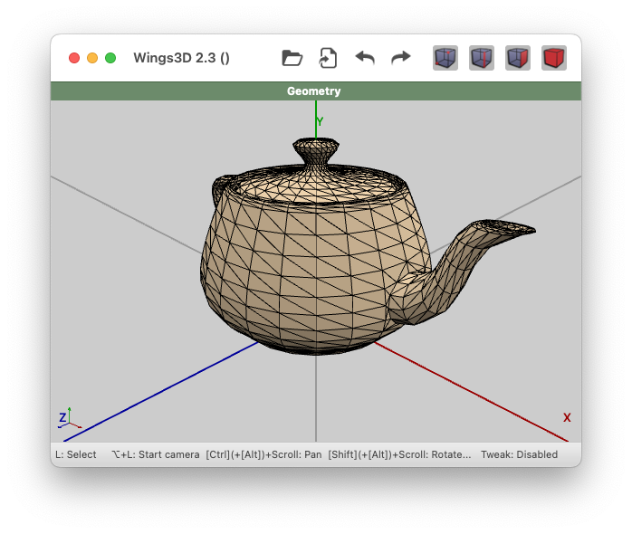
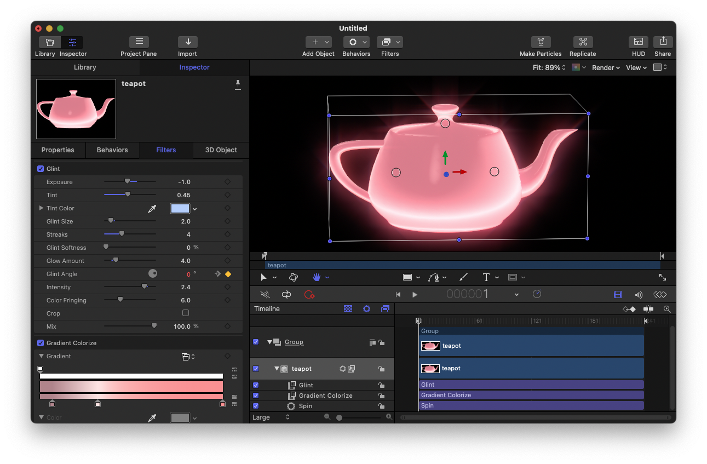

mdlconv
=======

Convert 3D model files


Usage
=====

Convert a Wavefront model named `input.obj` to a Universal Scene
Description model named `output.usd`.

```
$ mdlconv input.obj output.usd
```


Example
=======

Convert a Utah teapot from `.obj` to `.usdz`. We start with a Utah
teapot opened in Wings3D.



Convert `teapot.obj` to `teapot.usd` then package it as `teapot.usdz`

```
$ mdlconv Examples/teapot.obj teapot.usd
$ zip -0 teapot.usdz teapot.usd
```

We can then import `teapot.usdz` into Motion.


